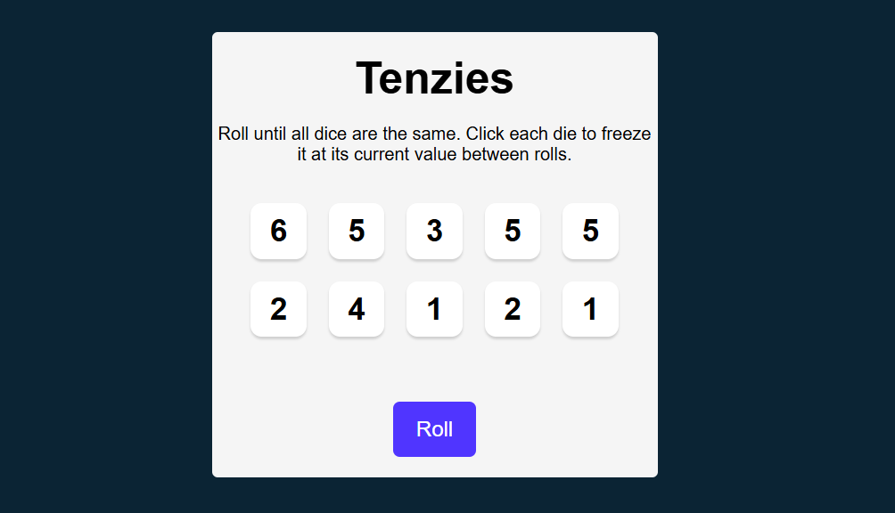
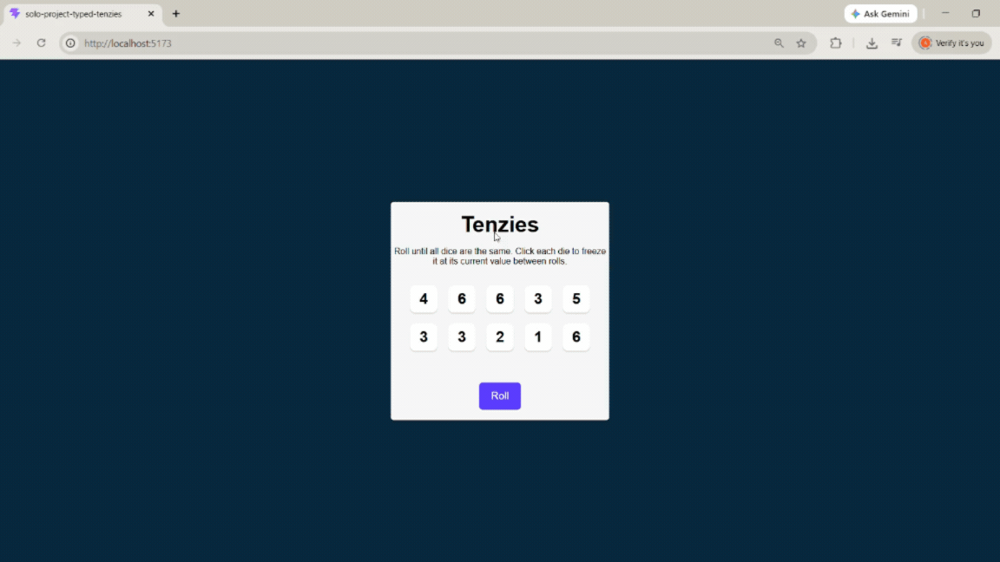

# Solo Project Typed Tenzies
A solo project from Scrimba’s TypeScript course. The original Tenzies game (built with React and JavaScript) was provided as starter code By Scrimba. This was a refactor assignment. I fully refactored the given codebase into a working TypeScript version by adding typed components, functions, and generics. 

About the game: Tenzies is a dice‑rolling game where the goal is to get all ten dice to show the same number. Each die is randomly assigned a value from 1 to 6. As you play, you “hold” any dice showing the number you’re aiming for, and continue rolling the remaining dice until all ten match.

## Tech Stack
- React
- Vite (with HMR)
- @vitejs/plugin-react 
- ESLint 
- Babel
- TypeScript 

## Dependencies
- "nanoid": "^5.1.16",
- "react": "^19.2.8",
- "react-confetti": "^6.4.0",
- "react-dom": "^19.2.8"

## Installation
Clone the repository, navigate into the project folder, and install dependencies:

```bash
npm install
```

## Start the development server

```bash
npm run dev
```

## Requirements 
- Recreate the Tenzies game app (React-JavaScript) into React TypeScript
    - Create a new React + TS project using Vite
- Add typing to all components and logic 


## Usage/Examples
Working TypeScript version



### App Demo



## License

This project is licensed under the MIT License.  
See the [License](./LICENSE) file for details.


## Acknowledgements/References
 - Scrimba (Course Material) — Original JavaScript version of the Tenzies React game supplied as starter code. Please see the '0G_Tenzies' folder in the repository for the JavaScript version. 
 - [Generics - TypeScript Documentation](https://www.typescriptlang.org/docs/handbook/2/generics.html)
 - [Hooks (UseEffect and UseRef) - TypeScript Documentation](https://react-typescript-cheatsheet.netlify.app/docs/basic/getting-started/hooks/#useeffect--uselayouteffect)
 - [react confetti Package](https://npm.io/package/react-confetti)
 - [nanoid Package](https://github.com/ai/nanoid)

